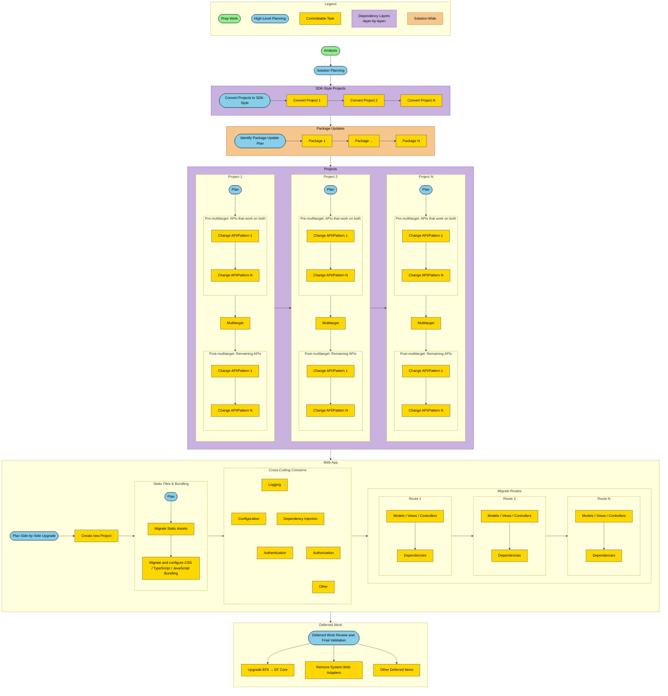
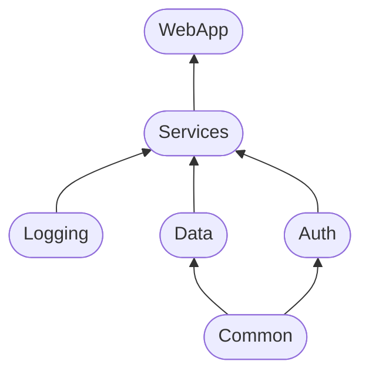
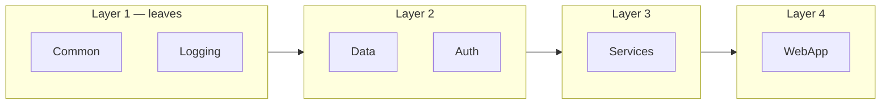

# fx2dotnet

A GitHub Copilot agent plugin that guides developers through migrating .NET Framework applications to modern .NET (targeting .NET 10 by default).

The goal is not to automate the migration — it's to **decompose it into small, reviewable chunks** that a developer can reason about and commit independently. The plugin identifies what needs to change, breaks the work into focused steps, and walks you through them one at a time. Each step produces a minimal, understandable diff rather than a sweeping transformation, so you stay in control and can validate every change before moving on.

## Prerequisites

- **VS Code** with [GitHub Copilot](https://marketplace.visualstudio.com/items?itemName=GitHub.copilot-chat) installed
- **.NET SDK 10** (preview) — see `global.json` for the pinned version
- **MCP servers** configured in `.mcp.json` (included in this repo) — VS Code starts them automatically

## Quick Start

1. Open your .NET Framework solution folder in VS Code alongside this plugin folder (multi-root workspace).
2. In Copilot Chat, invoke the **`.NET Framework to Modern .NET`** agent with your solution path:

   > @.NET Framework to Modern .NET `path/to/YourSolution.sln`

3. The orchestrator runs Assessment → Planning first, then walks you through each migration phase. Every step produces a small, committable diff — review and commit as you go.

To run a single phase instead of the full orchestration, invoke any agent directly (e.g., **`@Assessment of .NET Solution for Migration`**).

## How It Works

The plugin decomposes a .NET Framework → modern .NET migration into strictly ordered phases, each handled by a purpose-built agent:

| Phase | Agent | What it does |
|-------|-------|-------------|
| 1. Assessment | **Assessment** | Classifies every project (web host, Windows Service, library, etc.), audits NuGet package compatibility, identifies blockers, and produces a baseline report. Uses **Project Type Detector** for per-project classification. |
| 2. Planning | **Migration Planner** | Synthesizes assessment findings into a phased execution plan — topological project order, chunked package updates, SDK conversion candidates, and multitarget sequencing. Read-only; no code changes. |
| 3. SDK Conversion | **SDK-Style Project Conversion** | Converts legacy `.csproj` files to SDK-style format in dependency order, invoking **Build Fix** after each conversion to validate. |
| 4. Package Compatibility | **Package Compatibility Core** | Applies the planner's chunked NuGet update schedule (no-change → minor → major), with **Build Fix** validation after each chunk. |
| 5. Multitargeting | **Multitarget Migration** | Adds the modern target framework (`net10.0`) alongside the existing one, fixing API incompatibilities before and after the `TargetFrameworks` switch. |
| 6. Web Migration | **ASP.NET Framework → ASP.NET Core** | Creates a new ASP.NET Core host side-by-side, ports routes incrementally (using **Legacy Web Route Inventory** for endpoint discovery), and validates endpoint parity. |
| 7. Deferred Work | — | Post-migration items: EF6 → EF Core upgrade, System.Web adapter removal, and other flagged tasks. |

**Build Fix** runs an iterative build → diagnose → fix loop and is called throughout every phase to catch regressions early.

## Migration Flow

The diagram below maps the full end-to-end workflow across all phases. Each phase feeds into the next — from initial analysis through deferred post-migration work. Sub-steps are expanded within each phase to show the granular tasks. Green nodes are prep work, blue nodes are planning steps, gold nodes are committable tasks that produce code changes, lavender-shaded phases are processed layer by layer using dependency layers (see [Dependency Layers](#dependency-layers)), and peach-shaded phases are applied solution-wide.

## Dependency Layers

Phases 3 and 5 (SDK conversion and multitargeting) process projects **layer by layer**. During assessment, the `ComputeDependencyLayers` tool groups the topological project list into dependency layers:

- **Layer 1** — leaf projects with no in-solution dependencies.
- **Layer 2** — projects that depend only on Layer 1 projects.
- **Layer *N*** — projects that depend only on projects in earlier layers.

All projects in a layer must complete before the next layer begins, but projects **within** the same layer are independent and can be processed in any order. This guarantees every project's dependencies are already migrated before it is touched.

The diagrams below illustrate this with a hypothetical solution dependency graph.

**Dependency Graph:**

**Dependency Layers:**

## Architecture

### Skills (Domain Policies)

Skills encode migration best practices that override default agent behavior in specific domains:

- **EF6 Migration Policy** — Retain Entity Framework 6 during the framework migration; upgrade to EF Core only as a separate post-migration effort.
- **System.Web Adapters** — Use `Microsoft.AspNetCore.SystemWebAdapters` to minimize code changes for `System.Web` types; rewrite to native ASP.NET Core APIs post-migration.
- **Windows Service Migration** — Replace `ServiceBase` with `BackgroundService` + Generic Host using `Microsoft.Extensions.Hosting.WindowsServices`.

### MCP Tool Servers

- **Microsoft.GitHubCopilot.AppModernization.MCP** — Project analysis, SDK-style conversion, build tooling.
- **Swick.Mcp.Fx2dotnet** — Discovers minimum NuGet package versions needed for a target framework, resolves feeds, and reports legacy packaging patterns.
